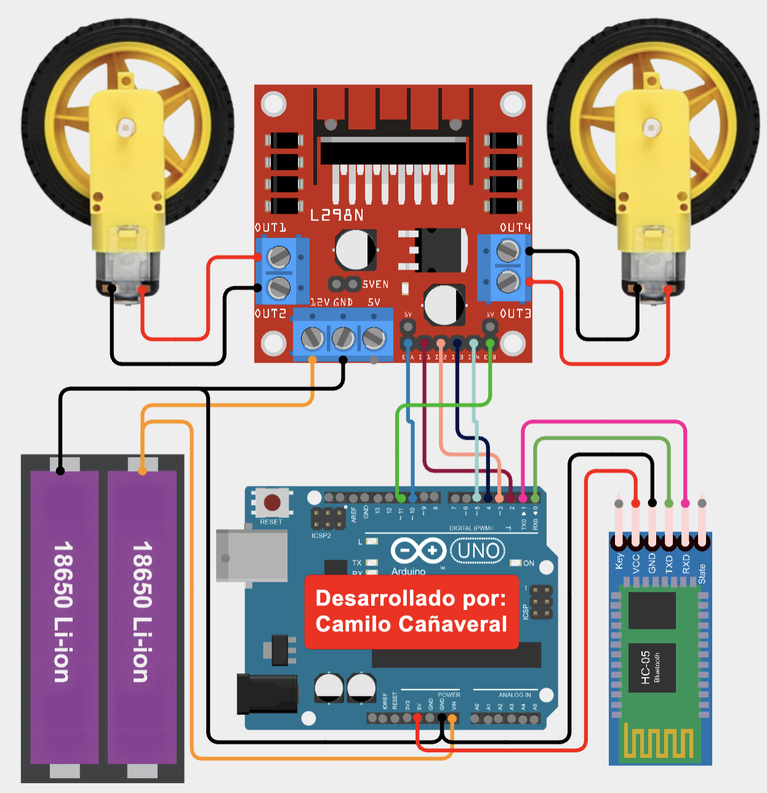
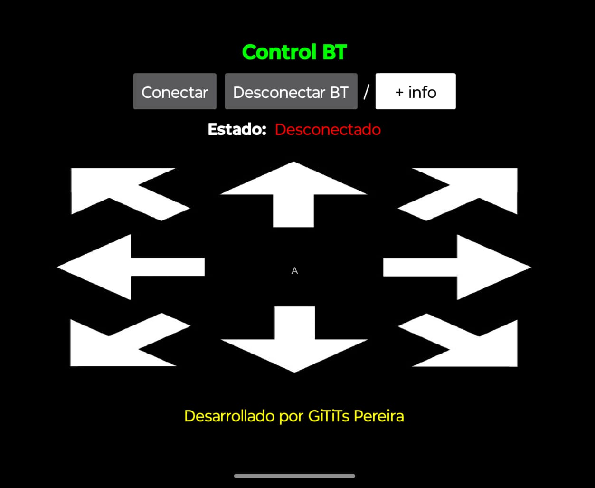

# Arduino_BT_Car
Proyecto para controlar un Arduino de forma inalámbrica a través de una aplicación de Android con bluetooth.

## Componentes necesarios
* Lista los componentes de hardware (Arduino, cables, etc.).
* Arduino UNO
* Módulo Bluetooth HC05 o HC06
* Motorreductores
* Driver L298N (Puente H)
* Batería de 6-12V

---

## Guía de conexión
Este es el diagrama de conexión para el proyecto:

Sigue los pasos a continuación para un montaje correcto:

#### 1. Conexión de la alimentación y los motores 🔋🚗

* **Baterías al L298N:** Conecta el polo **positivo (+) de la batería** al pin **12V** del módulo L298N. Conecta el polo **negativo (-) de la batería** al pin **GND** del mismo módulo.
* **Motores al L298N:** Conecta los cables del **motor izquierdo** a los pines **OUT1 y OUT2**. Conecta los cables del **motor derecho** a los pines **OUT3 y OUT4**.

#### 2. Conexión del módulo Bluetooth HC-05 📱📡

* **Alimentación:** Conecta el pin **VCC** del HC-05 al pin **5V** del Arduino. Conecta el pin **GND** del HC-05 a un pin **GND** del Arduino.
* **Comunicación:** Conecta el pin **RXD** del HC-05 al pin **TX** (pin 1) del Arduino. Conecta el pin **TXD** del HC-05 al pin **RX** (pin 0) del Arduino.

#### 3. Conexión del L298N al Arduino UNO 🧠🔌

* **Pines de control:**
    * Conecta el pin **ENA** del L298N al pin **10** del Arduino.
    * Conecta el pin **IN1** del L298N al pin **2** del Arduino.
    * Conecta el pin **IN2** del L298N al pin **3** del Arduino.
    * Conecta el pin **IN3** del L298N al pin **4** del Arduino.
    * Conecta el pin **IN4** del L298N al pin **5** del Arduino.
    * Conecta el pin **ENB** del L298N al pin **11** del Arduino.
* **Pines de alimentación:** Conecta el pin **5V** del driver L298N a un pin **5V** del Arduino y el pin **GND** del L298N a un pin **GND** del Arduino.

---

## Código para Arduino

### Carga del Código en Arduino 👨‍💻

1.  **Instala el IDE de Arduino:** Si aún no lo tienes, descarga e instala el **IDE de Arduino** desde su [página oficial](https://www.arduino.cc/en/software).
2.  **Abre el código:** Abre el archivo `CarroBT.ino` de este repositorio en el IDE de Arduino.
3.  **Conecta la placa:** Conecta tu placa Arduino a la computadora usando el cable USB.
4.  **Selecciona la placa y el puerto:** En el IDE, ve a **Herramientas > Placa** y selecciona **Arduino UNO**. Luego, en **Herramientas > Puerto**, elige el puerto correcto al que se conectó tu Arduino (por ejemplo, COM3 o /dev/cu.usbmodem1411).
5.  **Sube el código:** Haz clic en el botón **Subir** (la flecha hacia la derecha) en la parte superior del IDE. El software compilará y cargará el código en la placa.
   
* Descarga el código para Arduino **aquí**: [CarroBT.ino](CarroBT.ino)

---

## Aplicación de Android

### Instalación de la Aplicación en Android 📱

Para instalar la aplicación y controlar el proyecto desde tu celular:

1.  **Descarga la APK:** Descarga el archivo de la aplicación `CarroBT.apk` que se encuentra en este repositorio. O puedes descargarlo de **aquí**: [CarroBT.apk](CarroBT.apk)
2.  **Habilita fuentes desconocidas:** Ve a la **Configuración** de tu teléfono, busca la opción de **Seguridad y privacidad** y habilita la instalación de aplicaciones de **"Fuentes desconocidas"** o **"Instalar apps de fuentes externas"**. Este paso es necesario para instalar aplicaciones que no provienen de Google Play Store.
3.  **Instala la APK:** Busca el archivo APK que descargaste en la carpeta de descargas de tu teléfono y tócalo para iniciar la instalación.
4.  **Abre la aplicación:** Una vez instalada, busca el ícono de la aplicación en la pantalla de inicio y ábrela para empezar a usarla.* 

### Guía de Uso de la Aplicación Móvil 📱

Una vez que hayas instalado la aplicación, sigue estos pasos para conectarte a tu proyecto de Arduino y controlarlo.

1.  **Enciende el Bluetooth:** Al abrir la aplicación, un mensaje emergente te pedirá que actives el Bluetooth de tu celular si no lo está. Acepta para continuar.
2.  **Conexión al Arduino:**
    * Presiona el botón **"Conectar"** para escanear y emparejarte con tu módulo **HC-05**.
    * Verifica que el estado de la conexión cambie de **"Desconectado"** (en rojo) a **"Conectado"** (en verde).
3.  **Control del Robot:**
    * Una vez conectado, el robot responderá a las teclas de dirección.
    * **Adelante:** La aplicación envía la letra **B**.
    * **Atrás:** La aplicación envía la letra **C**.
    * **Derecha:** La aplicación envía la letra **D**.
    * **Izquierda:** La aplicación envía la letra **E**.
    * **Detener:** Al dejar de presionar las flechas, la aplicación envía la letra **A** para detener el movimiento.
    * Puedes ver la letra que se está enviando en tiempo real en la parte central de la interfaz.
4.  **Desconexión Segura:**
    * Antes de cerrar la aplicación, es recomendable presionar el botón **"Desconectar"**.
    * Confirma la desconexión observando que el estado cambie de nuevo a **"Desconectado"** (en rojo).

¡Listo! Con estos sencillos pasos, tus estudiantes podrán utilizar la aplicación para controlar el robot sin problemas.

---

## Contacto

Cristian Camilo Cañaveral Avilés  
Ing. Mecatrónico  
Email: camilo.canaveral@itspereira.edu.co
